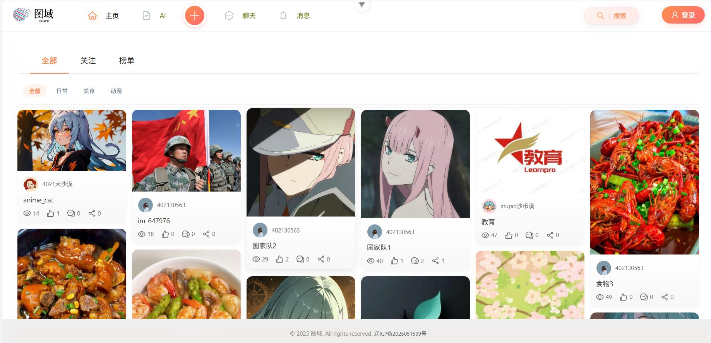
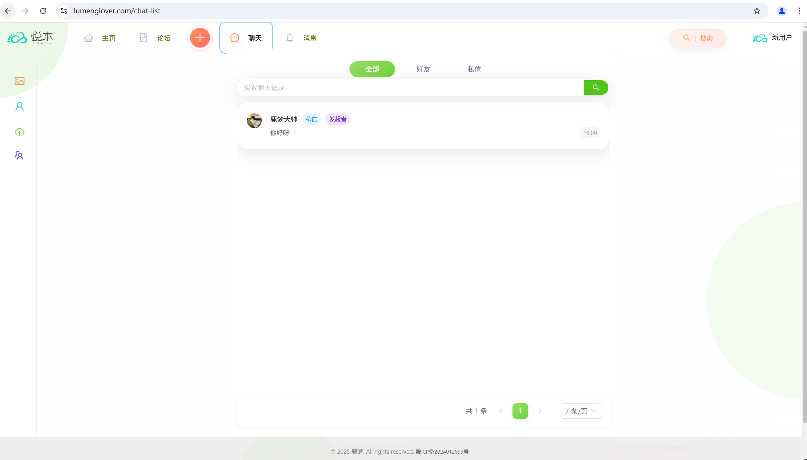
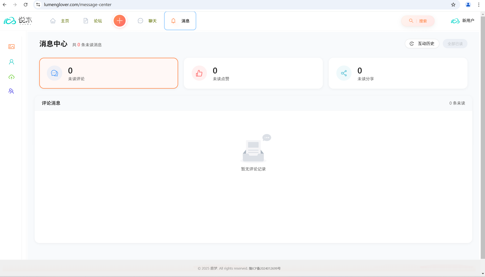
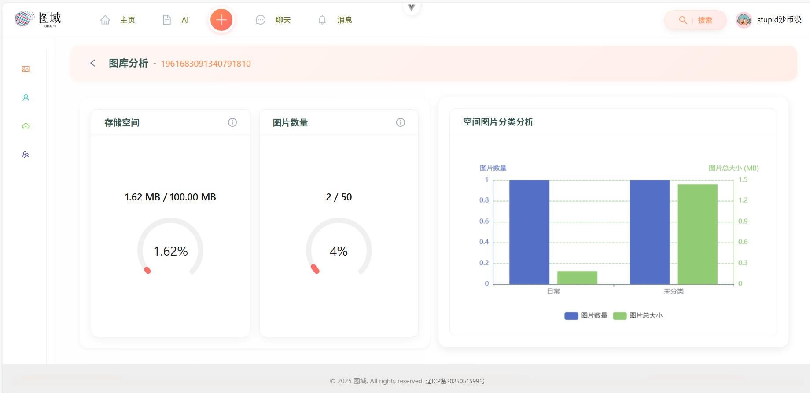
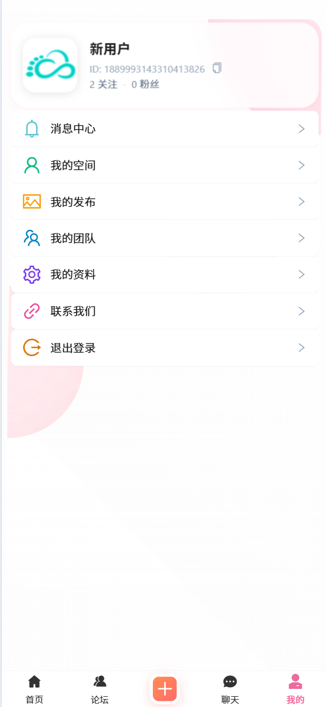
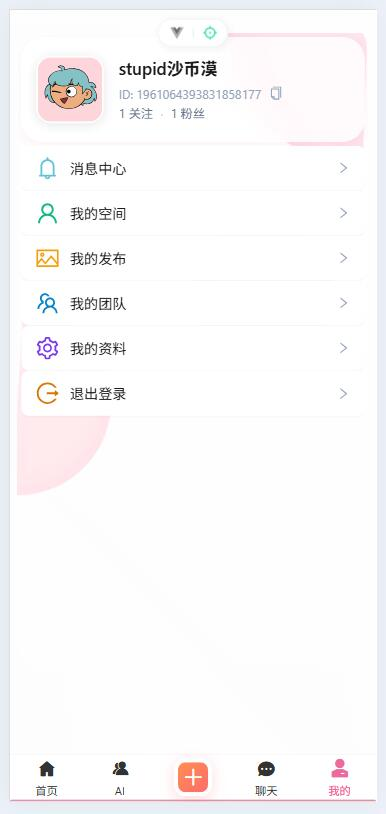
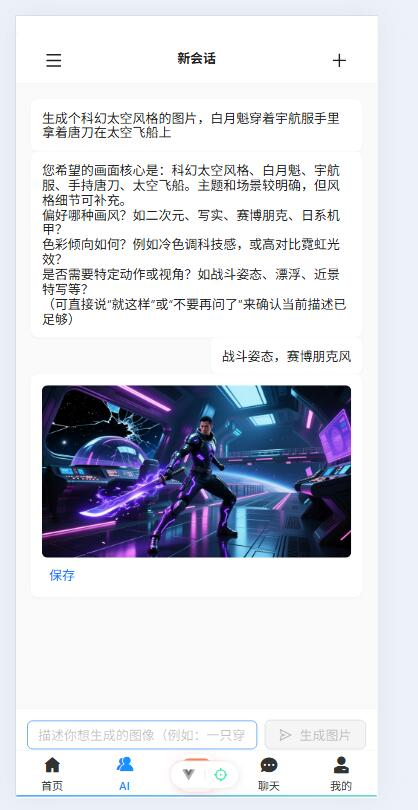

# 图域前端项目

一个基于 Vue 3 + TypeScript 开发的现代化图片分享社区前端项目。支持图片上传、分享、社交互动、空间管理等功能。









## 快速上手

1. 安装依赖

```bash
npm install
```

2. 启动开发服务器（默认 Vite）

```bash
npm run dev
```

3. 构建生产包

```bash
npm run build
```

## 关键提示（生产部署）

- 若需要代理后端 API，请在 `vite.config.ts` 中修改代理目标（production 环境替换为实际服务器地址）：

```ts
proxy: {
    '/api': {
        target: isProd ? 'your_server_url' : 'http://localhost:8123',
        changeOrigin: true,
        ws: true
    }
}
```

- 将 `.env.production` 中的 `VITE_WS_URL` 替换为实际的 WebSocket 服务地址（如果项目使用实时通信）。

## 技术栈

- Vue 3 + TypeScript
- Pinia（状态管理）
- Vue Router
- Vite（构建工具）
- Ant Design Vue（PC 端 UI）
- Vant（移动端 UI）
- Axios（HTTP 请求）
- ESLint + Prettier（代码规范）

## 主要功能（概览）

- 用户：登录 / 注册 / 邮箱验证 / 个人信息 / 关注
- 图片：上传 / 编辑 / 分类 / 搜索 / 列表展示
- 空间：创建空间、成员管理、空间分析
- 社交：评论、点赞、分享、私信聊天
- 消息：互动提醒、系统通知、未读消息列表

## 项目结构（概要）

下面是仓库的主要目录与文件（按重要性和使用频率排序）：

```
.
├─public/                 # 静态资源（favicon、预览图片等）
├─src/                    # 应用源码
│  ├─api/                 # 后端接口封装（userController.ts 等）
│  ├─assets/              # 组件或页面使用的本地资源
│  ├─components/          # 可复用组件（AvatarCropper、PictureList 等）
│  ├─constants/           # 常量定义（枚举、字面量）
│  ├─layouts/             # 应用布局组件（BasicLayout 等）
│  ├─pages/               # 页面级组件（路由视图）
│  ├─router/              # 路由配置
│  ├─stores/              # Pinia 状态管理
│  ├─utils/               # 工具函数（时间格式化、请求封装等）
│  └─views/               # 页面片段或组合视图
├─components.d.ts         # 全局组件类型声明
├─auto-imports.d.ts       # 自动导入类型声明
├─tsconfig*.json          # TypeScript 配置
├─vite.config.ts          # Vite 配置（代理、别名等）
├─package.json            # 依赖与脚本
└─README.md               # 本说明文档
```

目录说明（快速参考）

- `src/components/`：复用 UI 组件，按功能拆分，便于共享与测试。
- `src/pages/`：路由挂载的页面视图，通常为业务入口。
- `src/api/`：集中管理后端接口调用，便于 Mock 与替换实现。
- `src/stores/`：Pinia store，保存跨组件状态与异步动作。
- `public/`：不参与模块打包的静态文件，直接通过 URL 引用。

如果要快速定位代码实现，推荐的阅读顺序：页面（`src/pages/`）→ 组件（`src/components/`）→ 接口（`src/api/`）→ 状态（`src/stores/`）。

## 常用环境变量

- `.env` / `.env.local` / `.env.production`
    - VITE_API_BASE_URL：后端 API 地址（如果未使用 Vite proxy）
    - VITE_WS_URL：WebSocket 服务地址

（具体以项目中的 `.env.*` 文件为准）


